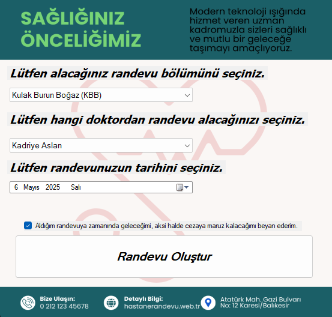
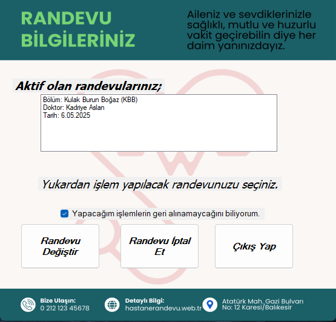

# 🏥 Hastane Randevu Sistemi

Bu proje, **C# Windows Forms** kullanılarak geliştirilmiş bir **Hastane Randevu Sistemi** uygulamasıdır. Kullanıcılar, sistem üzerinden doktorları listeleyebilir, uygun zaman dilimlerini seçerek randevu alabilir ve randevu bilgilerini görüntüleyebilir. Proje eğitim amaçlıdır.

## 🧩 Özellikler

- Doktorları listeleme
- Randevu almak için uygun zaman dilimlerini seçme
- Randevu bilgilerini görüntüleme
- Basit ve kullanıcı dostu arayüz

## 🛠️ Kullanılan Teknolojiler

- C# (Windows Forms)
- .NET Framework
- Visual Studio
- (Opsiyonel: JSON, XML ya da SQL Server ile veri saklama)

## 🖼️ Uygulama İçi Ekran Görüntüleri

- **Ana Ekran**  
  

- **Doktor Listesi**  
  

- **Randevu Detayları**  
  
